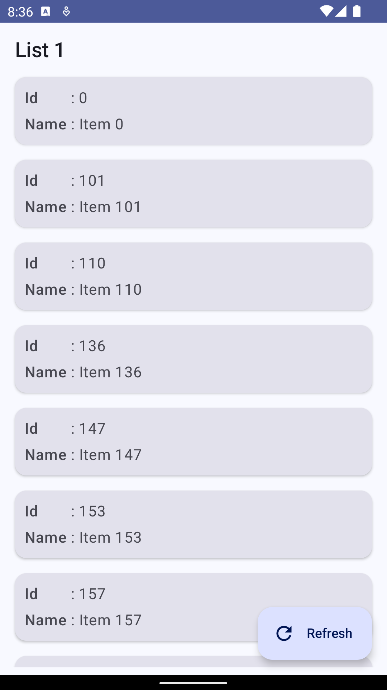
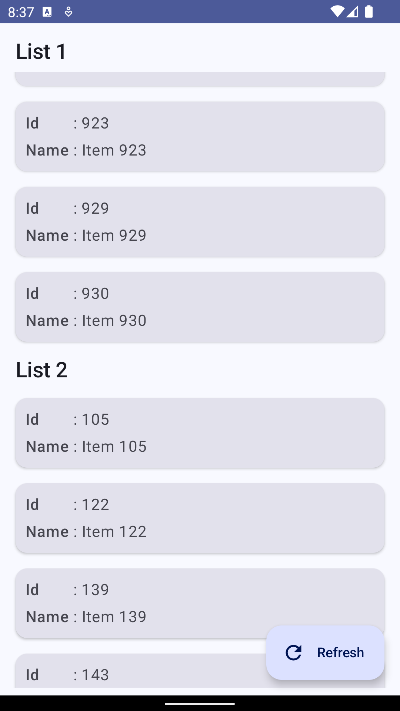
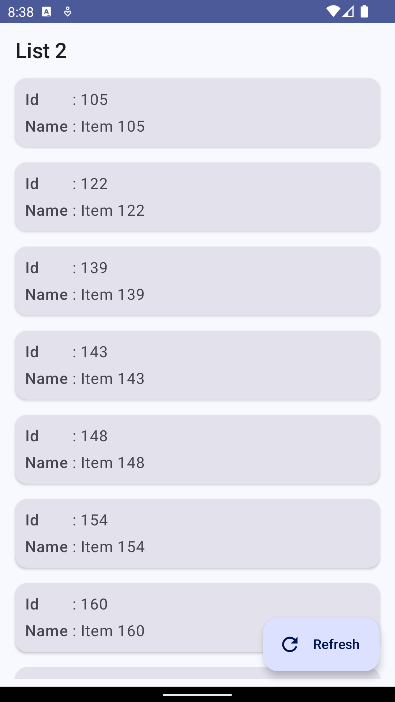
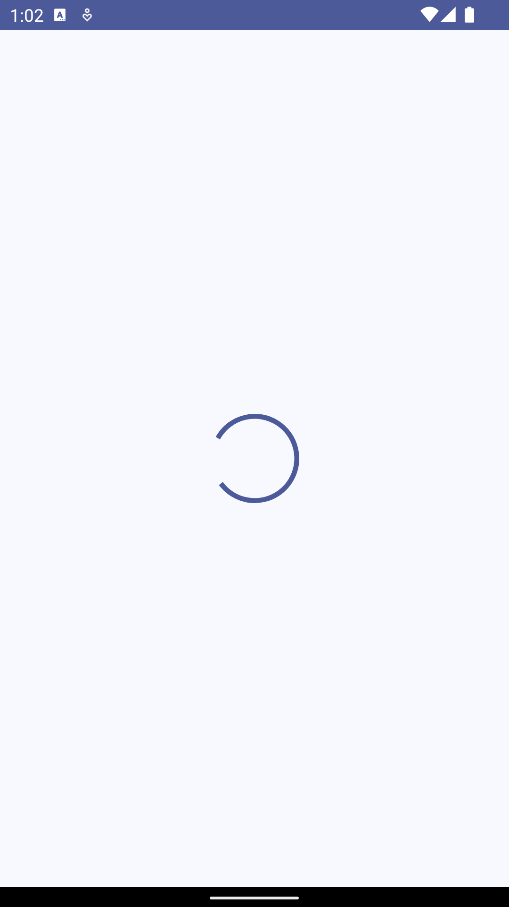
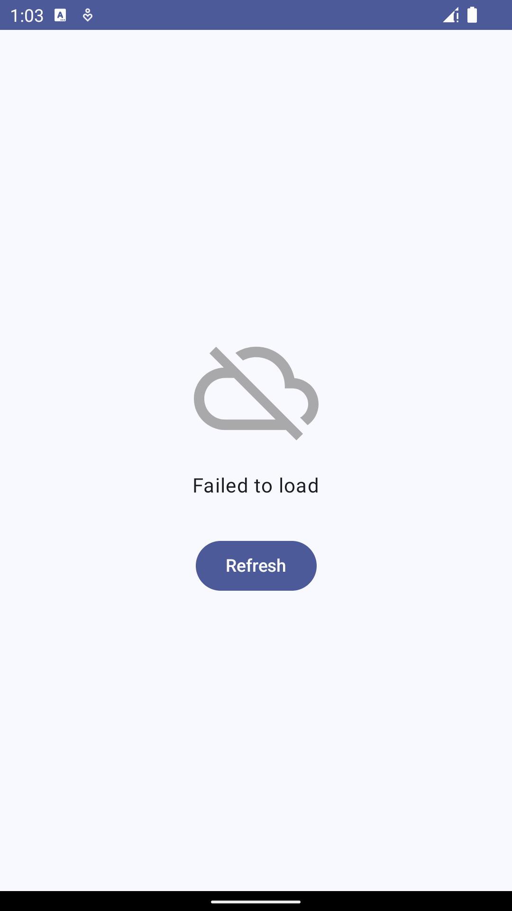

# Fetch Rewards App

A native Android app implemented in Kotlin that performs the following tasks
* retrieves the following Reward data from an [external API](https://fetch-hiring.s3.amazonaws.com/hiring.json).
  * _id_
  * _listId_
  * _name_
* filters out the data will null or blank _name_.
* sorts the data first by _listId_ and then by _name_.
* displays the data grouped by _listId_

## Screenshots

<p align="center">
  
  
  
</p>

## Technologies

* **Primary Language**: Kotlin
* **Framework**: Android SDK and Jetpack Compose
* **Testing**: JUnit and AndroidJUnit 
* **Build System**: Gradle 
* **Version Control**: Git 
* **CI/CD**: GitHub Actions 
* **Dependency Injection**: Dagger-Hilt 
* **Architecture**: MVVM (Model-View-ViewModel)

## Prerequisites

To build and test this Android application, you need the following:

- **Android Studio**: v2023.2.1 (Igua   na) [Download](https://developer.android.com/studio)
- **Physical Device** ([Setup](https://developer.android.com/studio/run/device)) or **Android Emulator** targetSdk: 34 ([Setup](https://developer.android.com/studio/run/managing-avds))

For more details on **System Requirements** and **Installation Process**, checkout [this link](https://developer.android.com/codelabs/basic-android-kotlin-compose-install-android-studio).


## How to install (optional)

There is an apk built from the latest code. You can use this to install and run the application.

 - Make sure `adb` is available by running the following command
      ```
      ~/Library/Android/sdk/platform-tools/adb
      ```
 - If not, add it to the `$PATH` variable following [this link](https://stackoverflow.com/questions/10303639/adb-command-not-found)
 - Install the apk by running the following command
     ```
     adb install -t dist/fetch-rewards.apk
     ```

## How to run

After setting up the necessary prerequisite, follow the below steps to run this application.

### Step 1 - Clone the repo

You can clone this repo to your local machine through either of the following ways:

- #### Android Studio (Recommended)
  - Open **Android Studio** 
  - Goto **File** > **New** > **Project from Version Control**
  - Paste `https://github.com/SaaiVenkat/fetch-rewards-app.git` into **URL** text field
  - Click **Clone**

- #### Git CLI
    ```
    git clone https://github.com/SaaiVenkat/fetch-rewards-app.git
    cd fetch-rewards-app
    ```
  - Open `Android Studio`
  - Goto **File** > **New** > **Import Project**
  - Choose **fetch-rewards-app**
  - Click **Open**

### Step 2 - Build the project
You can build the project either through Android Studio or through command line.
  - #### Android Studio
    - Select **Build** > **Make Project**
  - #### CLI
    ```
    ./gradlew assembleDebug
    ```

### Step 3 - Setup Device

You can run this app either through a Physical Android device or through an Android Emulator. 
Setup at least one device. 

  - #### Android Emulator
    - https://developer.android.com/studio/run/managing-avds

  - #### Physical Device
    - https://developer.android.com/studio/run/device

  - After setting up the device, select your device using **Run** > **Select Device**

### Step 3 - Setup Run Configurations
  - Goto **Run** > **Edit/Run Configurations**
  - Select **+** to add new configuration
  - Choose **Android App**
  - Name the configuration as `Fetch Rewards`
  - Select **FetchApplication.app.main** under **Module**
  - Click **Ok**

### Step 4 - Run the App
  - Select **Run** > **Run 'Fetch Rewards'**

## How to test
### Unit Tests
```
./gradlew assembleDebug
```
### Instrumented Tests
```
./gradlew connectedCheck
```

## App Screens

There are a total of three screens within the app's flow.
1. Home Screen
   - The main screen which displays the Rewards data grouped by _listId_ in a list view.
   - The _listId_ is displayed as a sticky header below which the corresponding _id_ and _name_ are displayed in a list view.
   - Scrolling the list view will update the new _listId_ to stick to the top.
   - Since the data loaded could be updated from the backend, there is refresh button to load the new data.

2. Loading Screen
   - The loading screen consists of a circular progress indicator which shows up whenever the data is being fetched from the API.

3. Error Screen
   - The error screen shows the failed to load error message, when the app fails to fetch the data from the API. 
   - This could be because of many reasons - no internet connection, and server down are the most common cases.
   - There is a refresh button to retry the loading mechanism.

## App Flows

### Use Case 1 
- The user opens the app with good internet connection and the server is also up.
- Based on the internet connection, the user might see the loading screen followed by the home screen.

<p align="center">
  
  
</p>

### Use Case 2
- After loading the home screen, the user can scroll the list view to see the rewards data grouped by _listId_. 
- This will stick the _listId_ to the top and the corresponding _id_ and _name_ will be displayed in a list view.

<p align="center">
  
  
  
</p>

### Use Case 3 
- New data can be loaded by clicking the refresh button on the home screen.
- This will show the loading screen followed by the home screen.

<p align="center">
  
  
  
</p>

### Use Case 4
- The user opens the app with no internet connection, or the server is down in the middle of fetching the data.
- This will show the error screen with a retry button.

<p align="center">
  
  
</p>

### Use Case 5
- After the user clicks the refresh button on the error screen, the app will try to fetch the data again, provided the internet connection is available and the server is up.
- This will show the loading screen followed by the home screen.

<p align="center">
  
  
  
</p>

## App Architecture

The application follows the Model-View-ViewModel (MVVM) architectural pattern, structured for maintainability, testability, and scalability.

- **Model**: Represents the business data layer of the app. In `com.fetch.app.model`, domain entity `Reward` is defined.

- **View**: Responsible for rendering UI components and responding to user interactions. In `com.fetch.app.ui`, the `MainActivity` and `HomeScreen` are part of the View layer, handling presentation and UI logic.

- **ViewModel**: In `com.fetch.app.ui.screen`, the `RewardsViewModel` serves as an intermediary between the View and Model, handling state management, UI-related data processing, and exposing streams of data to the View.

- **Repository**: Abstracts the data layer from the ViewModel and serves as a single source of truth for data. `com.fetch.app.repository` contains the `RewardsRepository` interface and its implementation `NetworkRewardsRepository`, which fetch data from network services.

- **Service**: Defines the API calls. `com.fetch.app.service` includes `FetchApiService`, which declares how the app communicates with the backend using Retrofit.

- **Dependency Injection**: Managed by Hilt, located in `com.fetch.app.di`, providing dependency injection to construct and provide instances of classes that the app requires.

- **Theme**: Contains UI theming elements like colors and typography, found in `com.fetch.app.ui.theme`.
